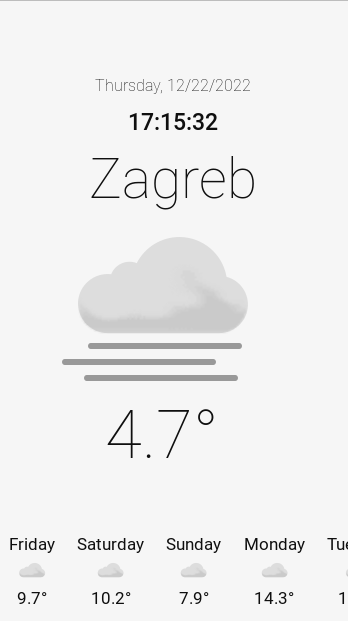
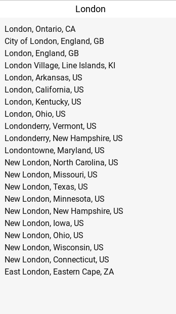

# Weather app

Cross-platform desktop app that shows a weather for a selected location. My goal with this app was to learn more about
Rust and Tauri.

# Preview

# API

Free weather API used in this app can be found [here](https://developer.yr.no/).